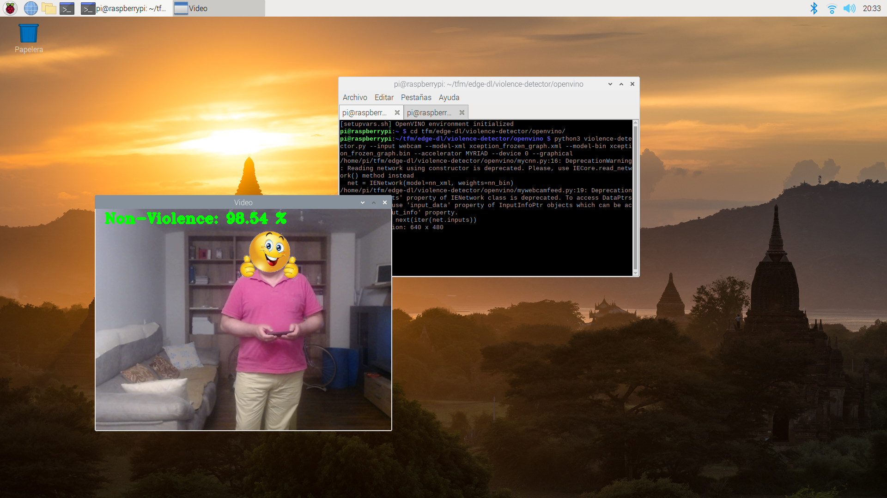

# Rasbperry Pi 3 installation

A raspberry Pi 3 B+ is used.

As Intel's OpenVINO is available for 32 bits Raspbian Buster has been used. It is possible to complile OpenVINO for 64 bits but this has been untested.

## Software versions

* Raspbian Buster (32 bits).
* OpenVINO toolkit 2021.2.

# Raspbian Buster installation

Raspbian has been installed in the usual way and updated to last level.

# OpenVINO 2021.2 installation

OpenVINO toolkit has been installed following the [official documentation](https://docs.openvino.ai/2021.2/openvino_docs_install_guides_installing_openvino_raspbian.html).

It can be downloaded from [Intel's Open Source page](https://download.01.org/opencv/2021/openvinotoolkit/2021.2/)

Once downloaded uncompress it:

```bash
root@raspberrypi:~# mkdir /opt/intel
root@raspberrypi:~# tar zxf l_openvino_toolkit_runtime_raspbian_p_2021.2.185.tgz -C /opt/intel/
root@raspberrypi:~# mv /opt/intel/l_openvino_toolkit_runtime_raspbian_p_2021.2.185/ /opt/intel/openvino_2021.2.185
root@raspberrypi:~#
```

and follow the official documentation.

## Check the OpenVINO runtime is working properly

To check if the Intel® Neural Compute Stick 2 (Intel® NCS2) is detected execute [check_inference_devices.py](../check_inference_devices.py):

```bash
pi@raspberrypi:~/edge-dl/movidius $ python3 check_inference_devices.py 
['MYRIAD']
pi@raspberrypi:~/edge-dl/movidius $
```

You can try with some Intel's models:

```bash
pi@raspberrypi:~ $ cd build
pi@raspberrypi:~/build $ git clone --depth 1 -b 2021.4.2 https://github.com/openvinotoolkit/open_model_zoo
pi@raspberrypi:~/build $ cd open_model_zoo/tools/downloader/
pi@raspberrypi:~/build/open_model_zoo/tools/downloader $
pi@raspberrypi:~/build/open_model_zoo/tools/downloader $ python3 -m pip install -r requirements.in
pi@raspberrypi:~/build/open_model_zoo/tools/downloader $ python3 downloader.py --name face-detection-adas-0001
```

## Install violence-detector application

Install violence-detector application as indicated in [OpenVINO violence-detector documentation](../../violence-detector/openvino/standalone.md).

